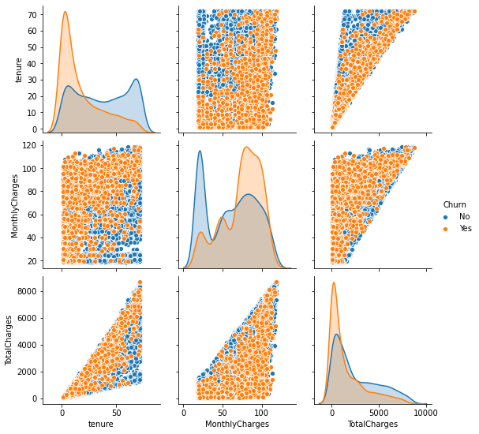
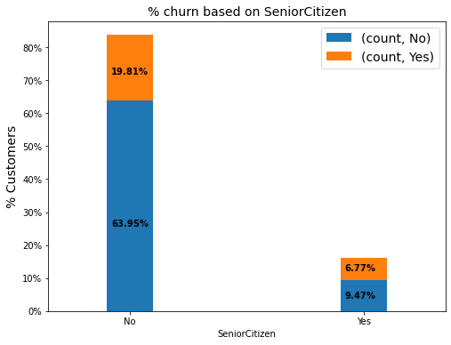
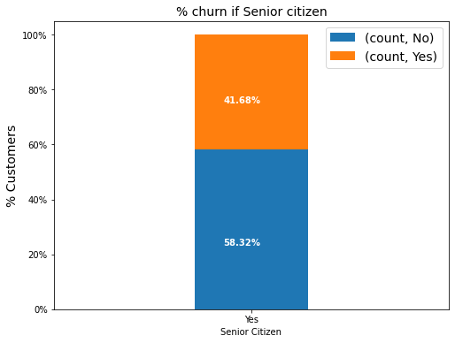
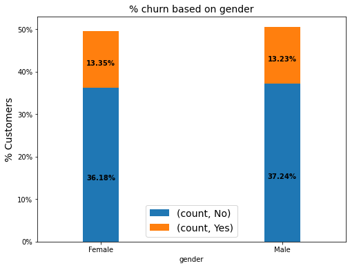
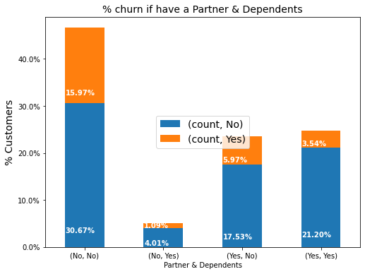
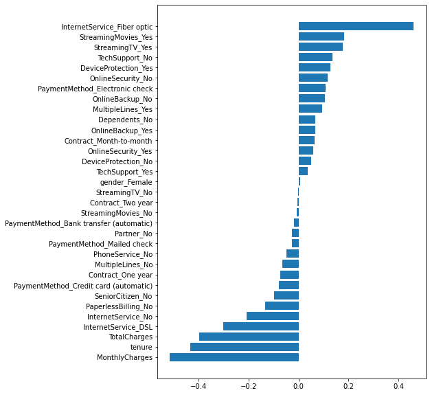

# Telecom Churn Prediction

Due to the Telecom market being a highly competitive one, there is always a threat of loosing the existing customers. There is a need to keep the customer from churning since every customer lost is a loss of revenue, at the same time, to make up for the loss, you need to acquire more customers. This is again a dent to the revenue since company needs to spend a significant amount to acquire a new customer and make profit from him.
 
Preventing customer churn is the necessity. The aim is to correctly predict a customer who is likely to churn and target them with offers relevant.
 

# 1. Data
Data has been taken from [Kaggle](https://www.kaggle.com/bandiatindra/telecom-churn-prediction/data). Each row represents a customer, each column contains customer’s attributes. The raw data contains 7043 rows (customers) and 21 columns (features). The “Churn” column is our target.

# 2. EDA

* People on lower tenure tend or higher charges to churn more.

 
* Senior Citizen are more likely to churn as compared to others.

 

 
* Gender does not seem to influence churn behaviour

 
* People having Partners or Dependents seem to be more loyal

# 3. Modelling
Preventing customer churn is the necessity. The aim is to correctly predict a customer who is likely to churn and target them with offers relevant. The model should have a higher recall since the company would not want false negatives and end up not targetting those who actually need to be targeted. But it is also imperative that the model would have a higher precision too since there goes a spending towards every customer you are targetting and the company would want to keep the spending as low as possible on the false positives.

We chose SVM with linear kernel, it produces an accuracy of 80% with a low False-Positive or False-Negative prediction as compared to other models, such as, Logistic Regression, Decision Tree or Randome Forest. The feature importances are:

# 4. Conclusion

Based on the feature importances it seems, the company should target on features that are the millenials' demands, such as, internet services and streaming services and should try attracting customers with incentives on longer term plans since people with a lower tenure/higher charges seem to be churning more.

# 5. Next Steps
I would like to spend more time into feature selection and dimensionality reduction like PCA and then try to generate models and see if those are improving our accuracy.
